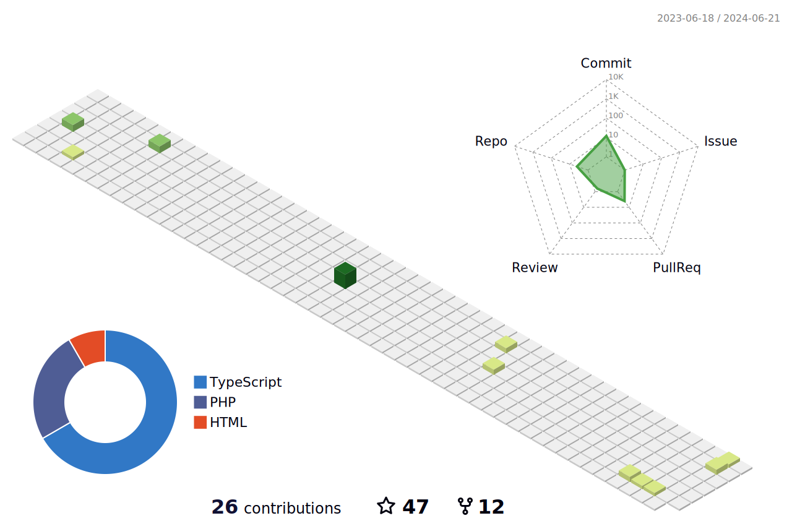

# Hello everyone, welcome to my github page 👋

## About me

- ⚡ My name is Patrick Jean, i'm 25 years old, brazilian and i love what i do;

- 🔭 Currently working as a Fullstack developer;

- 🌱 Learning Graphql, soft skills and how to fly a plane.

## Connect with me:

[][linkedin]
[][instagram]

## Languages and tools:

### Databases

### OS's

### Cloud

### Git

---

## Profile Stats

[instagram]: https://www.instagram.com/patrickjeanmeurer/
[linkedin]: https://www.linkedin.com/in/patrickjeanmeurer/
